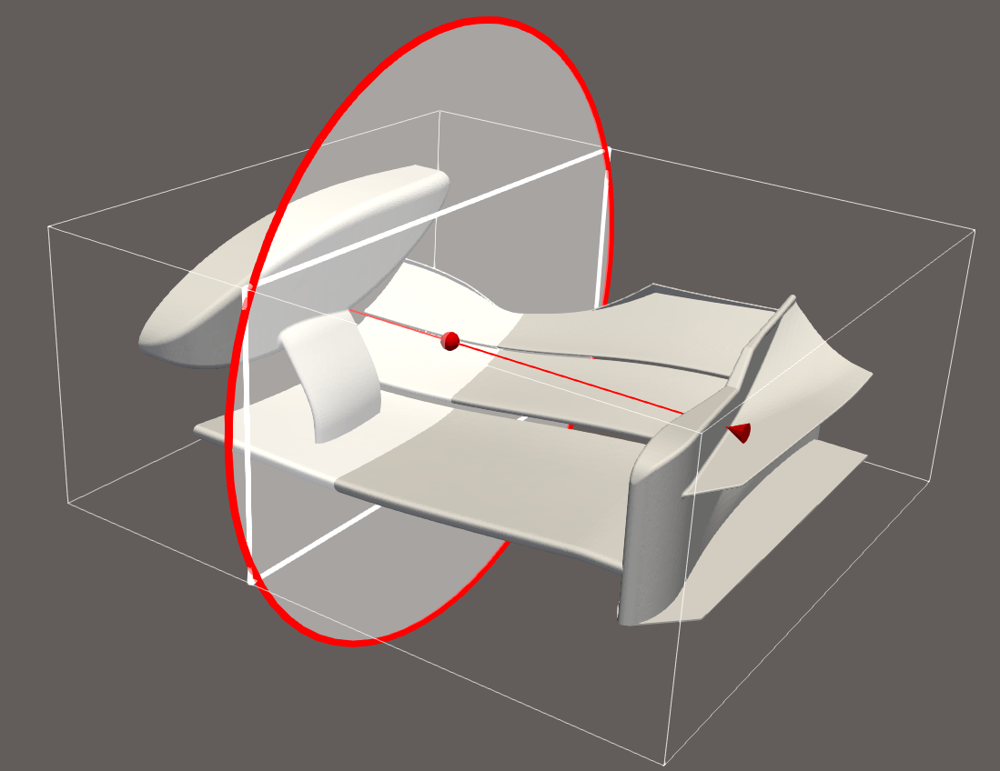
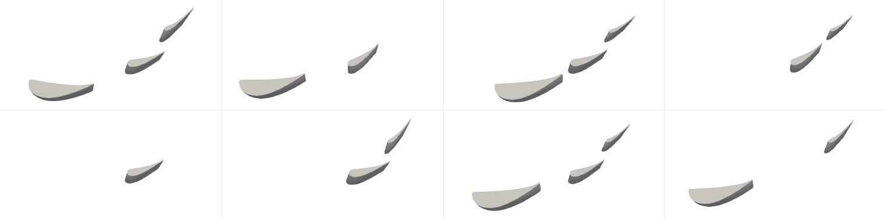
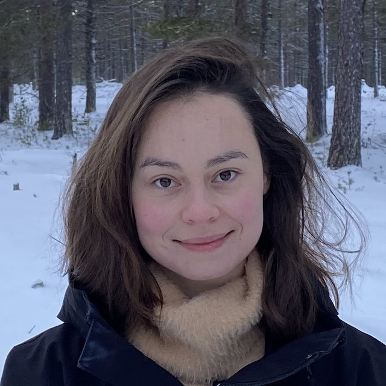

[](https://gram-workshop.github.io)
[](https://github.com/gram-competition/iclr-2026)
[](https://huggingface.co/datasets/gram-competition/warped-ifw)

&nbsp;&nbsp;&nbsp;

This year's competition hosted in conjunction with the Workshop on Geometry-grounded Representation Learning and Generative Modeling (GRaM) will be a **benchmark challenge**.
We have prepared a dataset of 3D geometries inspired by the front wing of a Formula 1 car for which BeyondMath kindly provided transient simulations of airflow specifically set-up for an academic-style challenge.

<video src="assets/airflow.mp4" controls autoplay muted loop playsinline preload="auto" height="180vw"></video>

The challenge is about generating airflow at future time points based on the geometry and airflow at previous time points.
The winner of the competition is going to receive the *MCML Award* consisting of **500 €** in prize money.
Furthermore, we are going to publish a description of the challenge and all valid submissions in the workshop proceedings and participants will have the option to be co-authors.

Submissions will take the form of **pull requests** to our GitHub repository (link above) and you can participate as a team.
For questions, open an issue on GitHub or email [gram.competition@proton.me](mailto:gram.competition@proton.me).

Deadline is on **April 22, 2026 (AoE)**.

# Challenge

Consider a 3D velocity field \\(u(t, x)\\) of airflow around an airfoil where \\(t_0 \le t \le t_1\\) and \\(x \in \Omega \subset \mathbb{R}^3\\).
Denote the airfoil surface by \\(\partial\Omega\\) and assume no-slip boundary condition:
\\[
u(t, x) = (0, 0, 0)^\mathsf{T} \hspace{12pt} \text{for} \hspace{12pt} x \in \partial\Omega.
\\]
Given \\(u(t, x)\\) for \\(t_0 \le t \le t_\mathbf{0.5}\\) our goal is to estimate \\(u(t, x)\\) for \\(t_\mathbf{0.5} < t \le t_1\\).
In other words, we are looking for a **neural operator** \\(G_{\partial\Omega}(t, x)\\) conditioned on the geometry of the airfoil \\(\partial\Omega\\) that predicts the velocity field at the following time points based on the preceding ones.

In practice, this can be any model that takes as input a discrete velocity field at a fixed number of time points and points in space, as well as the airfoil geometry.
Graph neural networks or transformers could be suitable models for this task.

Aerodynamics usually decompose into low-frequency ("laminar") and high-frequency ("turbulent") components.
The preceding velocity field already provides an excellent prior for the low-frequency components of the following dynamics.
For this reason, we expect the main difficulty of this challenge to be estimation of high-frequency components in the airflow.

# Dataset

Our dataset consists of 3D geometries made up of one, two or three differently-sized airfoils at randomly-sampled relative positions and pitch angles, thereby spanning a rich space of geometric variation.<sup>[†](#motivation-and-disclaimer)</sup>
The airfoil geometry is derived from the Imperial Front Wing (IFW), a Formula 1-style front wing CAD geometry developed at Imperial College London \[[Buscariolo, 2019](https://data.hpc.imperial.ac.uk/resolve/?doi=6049)\].



Airflow was simulated based on a constant freestream velocity in 181 of these geometries and we extracted five time windows from each simulation for our dataset.
In order to make the simulation results easier to work with, we subsampled a fixed number of points from the velocity field.
The airfoil surface is encoded as a subset of those points.

Samples (annotated by their dimensions) are saved as follows.
```
Dataset
├── "1021_1-0"                 "<simulation ID>-<index of time window>"
│   ├── t: (10,)
│   ├── pos: (100k, 3)
│   ├── idcs_airfoil: (20k,)      indexing pos with values in [0, 100k)
│   ├── pressure: (10, 100k)          provided for sake of completeness
│   ├── velocity_in: (5, 100k, 3)
│   └── velocity_out: (5, 100k, 3) 
│
├── ...
│
└── "3006_17-4"
    ├── t: (10,)
    ├── pos: (100k, 3)
    ├── idcs_airfoil: (8282,)             number differs per simulation
    ├── pressure: (10, 100k)
    ├── velocity_in: (5, 100k, 3)
    └── velocity_out: (5, 100k, 3)
```
The dataset can be downloaded from Hugging Face (link above).

# Ranking

Submissions will be evaluated on a held-out test split.
This means that all available data can be used by participants for training.
We do not disclose the specific evaluation metric, but it will measure accuracy, i.e., similarity of the estimated 3D velocity fields and the ground truth.

# Disclaimer

The aim of the challenge was to have a task involving sequential point-cloud prediction. Fluids were the first thing that came to mind. We've sliced a small part of the IFW and then scaled it anisotropically to create a new set of warped geometries. The data is designed in this specific way for the workshop competition (GRaM) rather than a fully experimentally validated CFD reference dataset. We targeted a consistent \\(y^+\\) regime and a lightweight setup, balancing accessibility for workshop participants with suitability for popular learning-based methods and comparative evaluation, i.e., keeping the cell count low but academically interesting enough in the broader context of what the workshop is about. This allows focus on the development of the geometric method.

The aim is to explore learning for the task of sequential point-cloud data on a fun and interesting geometrical set of variations.

# Organizers

<div class="organisers-grid">
  <div class="organiser-card">
    
    <div class="organiser-name">Alison Pouplin</div>
    <div class="organiser-affiliation">Bayer</div>
  </div>
  <div class="organiser-card">
    
    <div class="organiser-name">Gavin Seegoolam</div>
    <div class="organiser-affiliation">BeyondMath</div>
  </div>
  <div class="organiser-card">
    
    <div class="organiser-name">Julian Suk</div>
    <div class="organiser-affiliation">TU Munich</div>
  </div>
</div>
